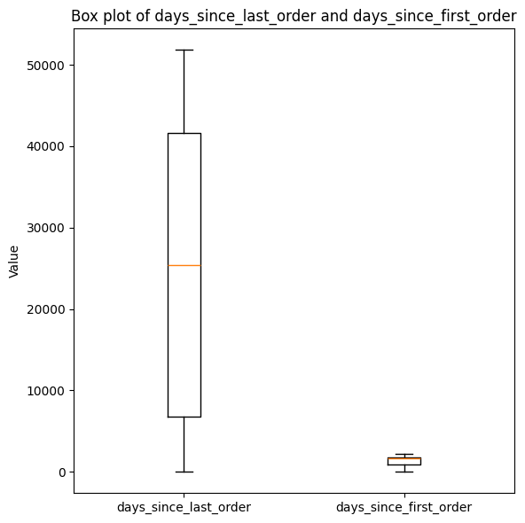

# Stage 1 : CLEAN

<a target="_blank" href="https://colab.research.google.com/github/trnhattan/GFG-DE-Technical-Test">
  
</a>

---

## 1. `NULL` stats

```bash
+------------------------+--------------+----------------+
|column                  |non_null_count|non_null_percent|
+------------------------+--------------+----------------+
|afterpay_payments       |46279         |100.0           |
|android_orders          |46279         |100.0           |
|apple_payments          |46279         |100.0           |
|average_discount_onoffer|46279         |100.0           |
|average_discount_used   |46279         |100.0           |
|cancels                 |46279         |100.0           |
|cc_payments             |46279         |100.0           |
|coupon_discount_applied |36074         |77.95           | <----
|curvy_items             |46279         |100.0           |
|customer_id             |46279         |100.0           |
|days_since_first_order  |46279         |100.0           |
|days_since_last_order   |46279         |100.0           |
...
```

→ There is only a column containing `null` values; values are the amount of discount price ⇒ the most feasible value to replace the `null` value is `0.0` 

## 2. Duplicates
- This is a customer snapshot data, number of purchased items, used devices, …, so each record should represent for a customer → unique `customer_id`
- `groupBy(customer_id)` → more than 2 hundreds duplicated records

```bash
+--------------------------------+-----+
|customer_id                     |count|
+--------------------------------+-----+
|42753fe23766ec59f9deeac24fa2b37c|2    |
|41ae01228cfaddc6a390ccdd8be05a66|2    |
|be480b8b55bde46111bfebe458e1b85e|2    |
|9190e94817c4509c3cbcb09a8b1e9677|2    |
|76a6a8ee5a2f768316071a1342d44e50|2    |
|20b429d6036995dfe30b108c5e1f0026|2    |
|87d7e5d6d3855d26242edecaae0e64d7|2    |
|f1b81544e10b9ed99b5143d93159914f|2    |
|d4abaacf27a894451ad754615b092ec0|2    |
|7cd0a8a06ce7b3f1b87e4c740641dce3|2    |
+--------------------------------+-----+
only showing top 10 rows
```

3. Wrong counting unit for `days_since_last_order` 
- Consider this box plot, the distribution of `days_since_last_order` shows an unusually large spread, with maximum values exceeding 50,000 days → `days_since_last_order` values might have been incorrectly recorded or computed in hours rather than days.



- Assumption: `days_since_last_order` divides by 24 → now show comparable scales and reasonable ranges


## 4. Validate `boolean` field, `is_newsletter_subscriber` 
- Instead of storing value of Y/N, we should convert to `boolean` for unified format.
  
## 5. **Final script:**

```python
rawDf
    # Fill NULL value of `coupon_discount_applied` with 0.0
    .withColumn("coupon_discount_applied", when(col("coupon_discount_applied").isNull(), lit(0.0)).otherwise(col("coupon_discount_applied")))      
    
    # Normalize `days` by dividing by 24
    .withColumn("days_since_last_order", (col("days_since_last_order") / 24.0).cast(IntegerType()))

    # Values are just Y/N only, normalize `flag` by validating yes -> true, no -> false
    .withColumn("is_newsletter_subscriber",
        when(upper("is_newsletter_subscriber") == "Y", True)
        .otherwise(False).cast(BooleanType())
    )

    # Some duplicated records
    .dropDuplicates()
```
