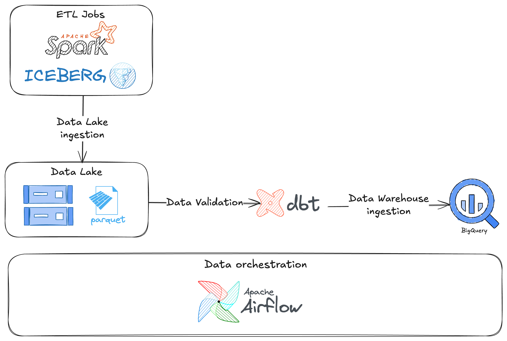

# Stage 4 : PRODUCTIONISATION

# Objective

This pipeline, assuming on GCP, captures daily customer snapshots, processes them with Spark, validates with dbt, and loads into BigQuery, all orchestrated by Airflow.

# **ETL and Storage**

- **ETL jobs**: Implemented using Apache Spark to collect, clean, and transform raw customer data. The transformed data is written into Google Cloud Storage (GCS) as Data Lake.
- Apache Iceberg, on demand of daily snapshot, versioning feature is crucial for not only preserve daily customer state, but also make it easy to:
    - Query specific snapshots, date
    - **Compare different days** to track trends or shifting behaviour.
    - Reliable rollback.
- **Data Storage**: Data is stored in GCS as parquet files, partitioned by date at the granular levels of year, month, and day (`year=/yyyy/month=/MM/day=/dd`)

# **Data Validation**

- **Validation**: dbt validates the data quality, integrity, and ensures consistency according to defined standards.
- **Loading**: After validation, data is delivered to Google BigQuery; keeping the schema due to this data is summary of customers’ behavior, and has been gathered from various sources.

# Orchestration

- Apache Airflow orchestrates the entire data pipeline, scheduling daily ingestion, validation, and warehouse loading tasks.